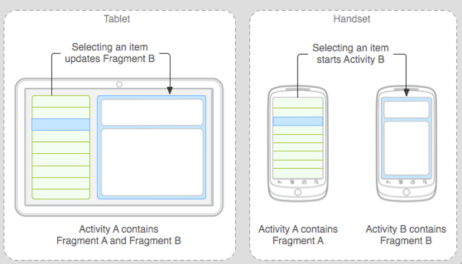

# Android Tech Interview

## 액티비티 생명 주기

A 액티비티 시작 -> A's `onCreate()` -> A's `onStart()` -> A's `onResume()` -> A 액티비티 실행

B 액티비티 실행되면, A's `onPause()` 호출.
A 액티비티가 화면상에서 보이지 않으면, A's `onStop()` 호출

A's `onPause()` 호출 후 A's `onStop()` 호출 이전 다시 A 액티비티가 화면상에 보이면 A's `onResume()` 호출과 함께 A 액티비티 실행
A's `onStop()` 호출 후 다시 A 액티비티가 화면상에서 보이면 A's `onRestart()` -> A's `onStart()` -> A's `onResume()` 호출과 함께 A 액티비티 실행

안드로이드 시스템 메모리 부족으로 A 액티비티를 종료 후 다시 A 액티비티를 시작하면 `onCreate()` 부터 다시 시작

finish() 메소드를 호출하거나 메모리 확보를 위해 액티비티를 제거할 때 `onDestroy()` 호출

> onStop()과 onDestroy()는 호출되지 않을 수 있음


## AsyncTask 를 직접 구현한다면 ?

`Thread`와 `Handler`를 이용한다.

```java
Thread t = new Thread(()->{
   (백그라운드에서 실행될 코드!)
   
   // Get a handler that can be used to post to the main thread
   Handler mainHandler = new Handler(context.getMainLooper());
   mainHandler.post(()->{
        (UI스레드에서 동작하게 하고 싶은 코드)
   });
});
t.start();
```

## Context 란?
어플리케이션의 현재 상태를 나타내는 객체로, 새롭게 생성된 객체가 컨택스트 객체를 통해 어플리케이션이 실행되고 있는 상황을 이해하는데 도움을 준다.
개발자 입장에서는 새로운 객체(뷰, 어뎁터 등)를 생성, 리소스 접근, 컴포넌트 접근을 위해 사용한다.

다음 방법으로 접근 가능 :  `getApplicationContext()`, `getContext()`, `getBaseContext()` or `this` (when in the activity class).

- 새로운 객체 생성 : 새로운 뷰, 어뎁터, 리스너
```java
TextView tv = new TextView(getContext());
ListAdapter adapter = new SimpleCursorAdapter(getApplicationContext(), ...);
```

- 리소스 접근 : LAYOUT_INFLATER_SERVICE, SharedPreferences
```java
context.getSystemService(LAYOUT_INFLATER_SERVICE)
getApplicationContext().getSharedPreferences(*name*, *mode*);
```

- 컴포넌트 접근 : Regarding content providers, broadcasts, intent
```java
getApplicationContext().getContentResolver().query(uri, ...);
```

## Intent filter 란?
Intent filter는 Manifest 파일에서 컴포넌트가 어떤 종류의 Intent를 처리할 수 있는지 명시함
만약 암시적 Intent를 생성한다면, 안드로이드 시스템은 앱들의 Manifest파일에 선언된 Intent fileter를 보고 적절한 컴포넌트를 찾음

## Fragment 란?
안드로이드에서 하나의 화면은 하나의 Activity로 대변
이러한 Activity를 View등을 이용해서 여러개로 쪼갤 수 있지만, 타블렛이나 팬블릿과 같이 스마트 폰과 다른 해상도를 사용할때 일일이 View를 다시 디자인 해야 하며, 또한 해당 화면 레이아웃이나 배치등을 다른 Activity에서 사용하고자 하면 매번 다시 만들어야 함



왼쪽은 타블렛 화면 레이아웃으로, 좌측에 메뉴와 오른쪽에 다른 형태의 컨텐츠가 나타난다.
이를 스마트 폰에서 볼때는 화면이 작기 때문에, 한 화면에서는 메뉴를 출력하고, 메뉴를 클릭하면 컨텐츠 화면으로 이동하도록 하는 형태인데, 이를 그냥 각각 구현하려면, 각 Activity에서 중복된 코드를 일일이 개발해야함
만약에 이러한 메뉴와 컨텐츠 화면이 포터블한 컴포넌트 형태로 묶이게 된다면 이를 재 사용해서 쉽게 만들 수 있음
즉 타블릿 화면에는 메뉴와 컨텐츠 컴포넌트를 출력하고, 스마트 폰에는 메뉴 화면에는 메뉴 컴포넌트를, 컨텐츠 화면에는 컨텐츠 컴포넌트를 출력하면 쉽게 개발이 가능

## AIDL 란?
Android Interface description language(인터페이스를 정의하는 언어)
RPC : 다른 주소 공간에서 함수나 프로시저를 실행할 수 있게하는 프로세스 간 통신 기술
서로 다른 프로세스 혹은 네트워크간에 함수를 호출하기 위해서는 인터페이스가 바뀔때마다 언어와 구조에 맞는 코드를 생성해주어야 하는데, 실제 코드를 생성하는 부분은 툴에 맞기고 프로그래머는 IDL만 정의하도록 구성

## StartService, BindService ?
StartService
- 액티비티가 죽더라도, 백그라운드에서 무한으로 동작
- 결과를 리턴하지 않음
- 사용 예) 네트워크에서 파일 다운로드 - 다 다운받고 알아서 종료

BindService
- 클라이언트, 서버 인터페이스 제공 - 프로세스 간 통신가능
- 하나도 바딩인하는 앱이 있으면 살아있고 모든 앱에서 언바인딩하면 서비스 종료

## 쓰레드간 통신방법

1. 쓰레드 생성
2. Looper 메소드 (prepare, loop) 호출 -> 메세지 큐를 확인하고 메세지가 있으면 처리
3. 메세지를 전송하고 처리할 Handler를 쓰레드에서 생성 -> handleMessage 정의
4. sendMessage 로 메세지 전송

## Looper 란?

메세지 큐에서 메세지를 꺼내서 핸들러에게 보내는 역할

## 암시적, 명시적 Intent 설명

암시적 Intent : 호출 대상이 명확하지 않는 Intent
명시적 Intent : 호출 대상이 명확한 Intent

## Service 와 Intent Service 차이
Service
- MainThread 를 사용하여, 긴 수행동작을 하면 안됨 -> 하려면 별도 쓰레드 생성해서 사용하자.
- UI 없이 수행
- 멈추는건 사용자 몫

Intent Service
- 별도의 쓰레드를 생성하여 사용하여, 긴 수행동작 가능
- 보통 메인 쓰레드와 상호작용하지 않음
- 모든 요청이 끝나면 알아서 종료

## Content Provider 와 Content Resolver 차이
Content Provider
- 한 Application 에서 관리하는 Database 를 다른 Application 에서 사용할 수 있도록 하는 방법
- 다른 앱 데이터베이스에 쿼리하기 위한 인터페이스 제공

Content Resolver
- 한 어플리케이션에 싱글턴으로 존재
- 클라이언트로부터 요청을 받아 Content Provider로

1. getContentResolver().query(Uri, String, String, String, String) 호출
2. Content Resolver는 uri를 파싱하고 그 authority을 추출
3. Content Resolver는 해당 authority로 등록된 Provider로 요청 지시
4. Content Provider에 query 호출

## ANR에 대해 설명
ANR (Application Not Responding) 은 어플리케이션이 응답하지 않는다는 에러
- 응용 프로그램이 5초 이상 사용자의 입력에 반응하지 않을 때
- 브로드캐스트 리시버(BR)가 10초 내로 리턴하지 않을 때
-> 장시간 걸리는 작업은 스레드로 분리하며, 작업이 끝난 후 할 일은 핸들러에서 처리하도록 분리

## Doze 모드
- Doze 모드에 빠지게 되면 배터리를 아끼고자 앱의 네트워크와 CPU 사용을 제한
- 비록 Doze 모드에 들어가 있더라도, 시스템이 주기적으로 Doze에서 빠져나와 미뤄둔 작업을 한 뒤에 다시 Doze로 들어감

Doze 모드 조건
1. 배터리 충전을 하지 않고 있고
2. 휴대폰이 물리적으로 가만히 있고
3. 스크린 오프 상태가 지속될 때

## Android MAT 설명
메모리 분석 도구로 메모리 릭을 발견 및 분석하여 메모리 소비를 줄일 수 있음

## Parcel 와 Serializable 비교

Serializable
- A standard Java interface.
 
Parcel
- Android specific interface.
- Serializable 보다 훨씬 빠름 (Why ? Serializable는 자바의 리플렉션을 이용, Parcel은 개발자가 모두 설정)

## FLAG_ACTIVITY_CLEAR_TOP, FLAG_ACTIVITY_SINGLE_TOP 플래그 설명

FLAG_ACTIVITY_CLEAR_TOP
- 액티비티 스택 맨 위에 생성하고자하는 액티비티가 이미 있으면 재사용
- 없거나 아래 있으면, 새로 생성
- 예) 0->1->2->3 에서 3 생성 시, 0->1->2->3

FLAG_ACTIVITY_SINGLE_TOP
- 액티비티 스택에 생성하고자하는 액티비티가 있으면 해당 액티비티부터 맨위 액티비티까지 제거 후 새로 생성
- 예) 0->1->2->3 에서 1 생성 시, 0->1
